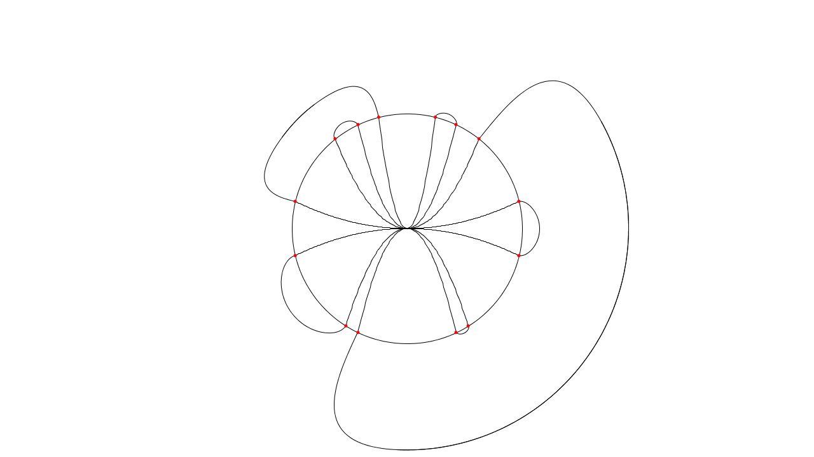
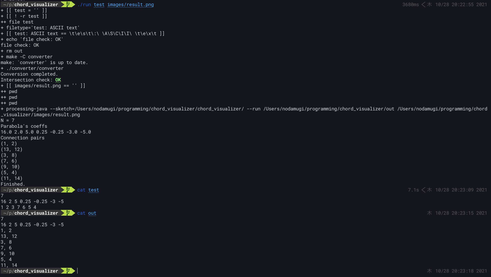
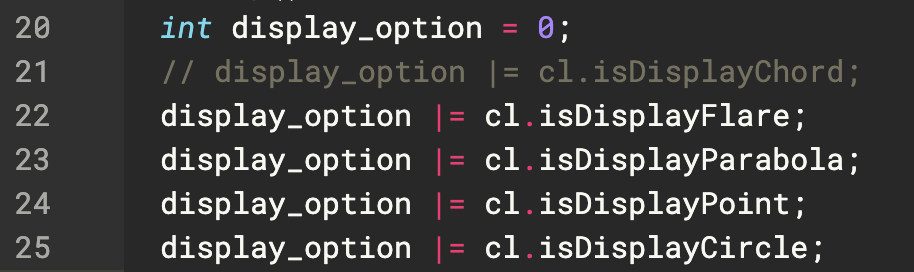

# chord_visualizer

- 記述に基づく弦と細胞膜のvisualizer



---
## Author
- M.Noda (GitHub: void-hoge)

## References
- Tosue,M. and K.Takahashi: "Towards a Qualitative Reasoning on Shape Change and Object Division," 14th International Conference on Spatial Information Theory (COSIT 2019), pp.7:1-7:15, LIPICS Vol. 142, ISBN 978-3-95977-115-3, September, 2019.

- 東末桃：「形状変化に関する定性的な記述方式と推論およびその性質について」関西学院大学大学院理工学研究科修士論文.

## License
- GPLv3

---

## Installation
- processingの実行環境が必要
- ~~converterをconverter/build/内にビルド~~
- makefileを追加し、runでコンパイルも行うようにした。

## Usage
- 順序の数列を記述したテキストファイルを用意
- `./run *filename*`で実行
- 例えば、`./run test`
- `./run *input* *image_name*`で、名前が image_nameの画像が出力される。
- 画像の形式は何も指定しないとTIFF(.tif)
- png、jpgなどが設定できる。(processingの[save関数](https://processing.org/reference/save_.html)を使用している。)
- Intersection checkは交差するかどうかのチェック。OKなら交差なし、NGなら交差あり。(色で強調されている)
- 実行時のターミナルの様子




## Requirements of input files
```
7
16 2 5 0.25 -0.25 -3 -5
1 2 3 7 6 5 4
```
- 1行目はnを入力する。(2次曲線の数、数列piの要素数)
- 2行目は各2次曲線の係数a
- 3行目は数列piが並ぶ
- 上のものは現在[test](test)に書いてある。

## Requirements of the converter
- 上記の入力ファイルの中身(n、2次曲線の係数、数列pi)を標準入力
- nは1行目に標準出力
- 2次曲線の係数は入力を受けた順番でそのまま2行目に標準出力する
- 数列piを、件のアルゴリズムに適合する1~2nまでの数字のペアの集合に変換し、3行目以降に標準出力する。
- 文字はスペース、コンマ区切り(どちらでも良い)
- 上の[test](test)から入力されたデータは、以下[out](out)のように出力される。
- この要件を満たすならば、C++でなければならないわけではない。

```
7
16 2 5 0.25 -0.25 -3 -5
1, 2
13, 12
3, 8
7, 6
9, 10
5, 4
11, 14
```

## Requirements of the chord_visualizer
- 上記のconverterの出力が書いてあるファイルのフルパスをコマンドラインオプションから渡す。
- 中身にアクセスできる必要がある。

## Configuration of the chord_visualizer
- 今のところ、何を描画するかはchord_visualizerのソースファイルに書く必要がある。
- [chord_visualizer.pde](chord_visualizer/chord_visualizer.pde)の28-32行目をコメントアウトしたりしなかったりすることで設定できる。
  - isDisplayChord: 弦を描画するかどうか
  - isDisplayFlare: 外側で点をつなぐ曲線を描画するか
  - isDisplayParabola: 2次曲線を描画するか
  - isDisplayPoint: 2次曲線と円が交わる点を赤色の点で描画するか
  - isDisplayCircle: 円を描画するか
- コメントアウトすると表示されなくなる。(画像では弦の描画を切っている)


