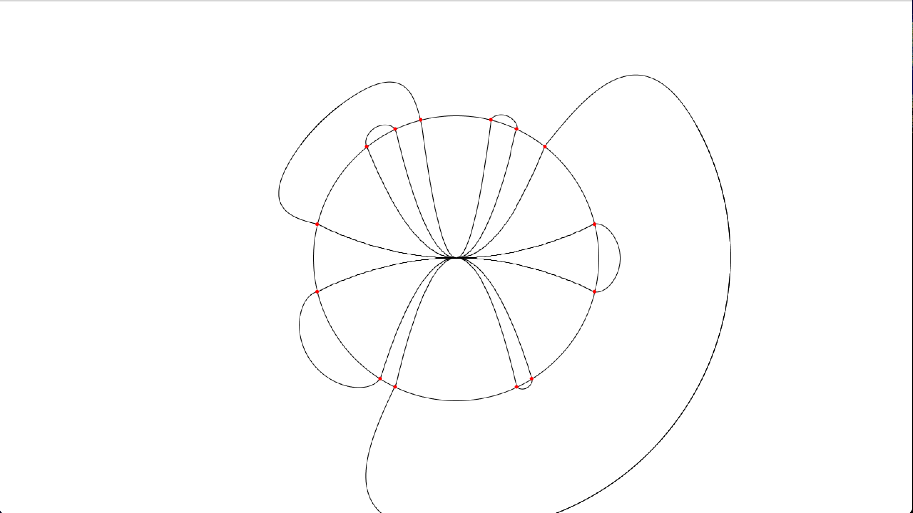

# chord_visualizer


## installation
- 少なくともMacに対応、おそらくLinuxにも対応、Windowsは非対応
- processingの実行環境が必要
- converterをconverter/build/内にビルド

## usage
- 順序の数列を記述したテキストファイルを用意
- `./run filename`で実行
- 例えば、`./run test`
- 実行時のターミナルの様子


## input fileの要件
```
7
16 2 5 0.25 -0.25 -3 -5
1 2 3 7 6 5 4
```
- 1行目はnを入力する。(2次曲線の数、数列piの要素数)
- 2行目は各2次曲線の係数a
- 3行目は数列piが並ぶ
- 上のものは現在[test](test)に書いてある。

## converterの要件
- 上記の入力ファイルの中身(n、2次曲線の係数、数列pi)を標準入力
- nは1行目に標準出力
- 2次曲線の係数は入力を受けた順番でそのまま2行目に標準出力する
- 数列piを、件のアルゴリズムに適合する1~2nまでの数字のペアの集合に変換し、3行目以降に標準出力する。
- 文字はスペース、コンマ区切り(どちらでも良い)
- 上の[test](test)から入力されたデータは、以下[out](out)のように出力される。
- この要件を満たすならば、C++でなければならないわけではない。Pythonでも良い。

```
7
16 2 5 0.25 -0.25 -3 -5
1, 2
13, 12
3, 8
7, 6
9, 10
5, 4
11, 14
```

## chord_visualizerの要件
- 上記のconverterの出力が書いてあるファイルのフルパスをコマンドラインオプションから渡す。
- 中身にアクセスできる必要がある。

## chord_visualizerの描画設定
- 今のところ、何を表示するかはchord_visualizerのソースファイルに書く必要がある。
- [chord_visualizer.pde](chord_visualizer/chord_visualizer.pde)の21-25行目をコメントアウトしたりしなかったりすることで設定できる。
  - isDisplayChord: 弦を描画するかどうか
  - isDisplayFlare: 外側で点をつなぐ曲線を描画するか
  - isDisplayParabola: 2次曲線を描画するか
  - isDisplayPoint: 2次曲線と円が交わる点を赤色の点で描画するか
  - isDisplayCircle: 円を描画するか
- コメントアウトすると表示されなくなる。(画像では弦の描画を切っている)


## TODO
- ファイルから表示設定ができるようにする(?)
